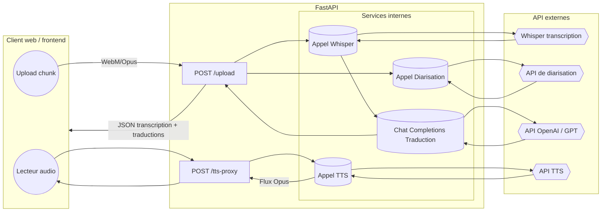

# api-translate-rt

Backend service that powers the translate-rt prototype. It exposes synchronous REST endpoints for chunk-based transcription/translation and a text-to-speech proxy used by the frontend.

## Diagramme d'architecture API



## Environment configuration

Populate the environment variables described below before launching `app.py`. The root project contains a [.env.example](../.env.example) file that can be copied to `.env` and customised for local runs.

| Variable | Required | Description |
| --- | --- | --- |
| `AUDIO_API_KEY` | ✅ | Bearer token passed to the Whisper transcription endpoint (`Cfg.WHISPER_URL`). |
| `OPENAI_API_KEY` | ✅ | Token used when requesting translations through `Cfg.OPENAI_API_BASE`. |
| `OPENAI_API_BASE` | ⚙️ | Base URL of the translation provider (defaults to the OpenAI public API). |
| `OPENAI_API_MODEL` | ⚙️ | Chat-completions model name used for translations (defaults to `gpt-oss`). |
| `DIARIZATION_TOKEN` | ⚙️ | Enables diarisation calls to `Cfg.DIAR_URL` when present. |
| `TTS_API_KEY` | ⚙️ | Required for `/tts-proxy` responses. |
| `TTS_API_URL` | ⚙️ | Overrides the default text-to-speech endpoint. |
| `SERVER_NAME` | ⚙️ | Host interface for the FastAPI server (defaults to `0.0.0.0`). |
| `SERVER_PORT` | ⚙️ | Listening port (defaults to `8080`). |

> ℹ️ Environment variables marked with ⚙️ are optional; omit them to rely on the defaults baked into [`app.py`](app.py).

### Local launch

```bash
python3 -m venv .venv
source .venv/bin/activate
pip install --upgrade pip
pip install -r requirements.txt
python app.py
```

The service will report the chosen host and port on start-up. Adjust `SERVER_NAME`/`SERVER_PORT` to bind to custom interfaces.

## REST endpoints

### `POST /upload`

* **Content type:** `multipart/form-data`
* **Form fields:**
  * `file` – required audio chunk encoded as WebM/Opus.
  * `target_lang` – BCP-47 code for the language shown in the translation panel.
  * `primary_lang` – optional primary language used to build additional translations.
* **Response:** JSON payload containing the detected language, raw transcription, diarisation metadata and translations (see snippet below).

```json
{
  "detected_lang": "en",
  "transcription": "Hello everyone!",
  "diarization": {
    "identifier": "speaker-1",
    "noise": false
  },
  "translation_fr": "Bonjour à tous!"
}
```

Use this endpoint to send discrete chunks recorded in the browser or uploaded from files. The helper script [`mini_OpenAPI.yaml`](mini_OpenAPI.yaml) summarises the payload/response shape.

### `POST /tts-proxy`

* **Content type:** `application/json`
* **Headers:** `Authorization: Bearer <TTS_API_KEY>` is injected by the server when configured.
* **Body:**

```json
{
  "model": "gpt-4o-mini-tts",
  "input": "Texte à dire",
  "voice": "alloy",
  "instructions": "Speak in a cheerful and positive tone.",
  "response_format": "opus"
}
```

The response streams an Opus audio payload suitable for immediate playback in the browser.

### `POST /translate-text`

* **Content type:** `application/json`
* **Body:**

```json
{
  "text": "Hello everyone!",
  "target_lang": "fr"
}
```

* **Response:**

```json
{
  "translation": "Bonjour à tous!"
}
```

Use this endpoint to translate plain text snippets without uploading audio. The `target_lang` field defaults to `fr` when
omitted and should contain a BCP-47 language code supported by the translation provider.

#### Python usage example

```python
import os
import requests

API_BASE = os.environ.get("TRANSLATE_RT_URL", "http://localhost:8080")
payload = {"text": "How are you?", "target_lang": "es"}

response = requests.post(f"{API_BASE}/translate-text", json=payload, timeout=30)
response.raise_for_status()

print(response.json()["translation"])
```

The snippet above posts a JSON payload to the backend and prints the translated text returned by the API.

#### cURL usage example

```bash
curl -X POST "${TRANSLATE_RT_URL:-http://localhost:8080}/translate-text" \
  -H "Content-Type: application/json" \
  -d '{"text": "How are you?", "target_lang": "es"}'
```

The command above sends a JSON body to the translation endpoint using environment variable `TRANSLATE_RT_URL` when defined (defaults to `http://localhost:8080`). The response contains the translated text as a JSON object.

## Related files

* [`../frontend/static/js/code.js`](../frontend/static/js/code.js) – frontend logic that connects to `/upload` and `/tts-proxy`.
* [`mini_OpenAPI.yaml`](mini_OpenAPI.yaml) – OpenAPI snippet that can be imported into API tooling.
