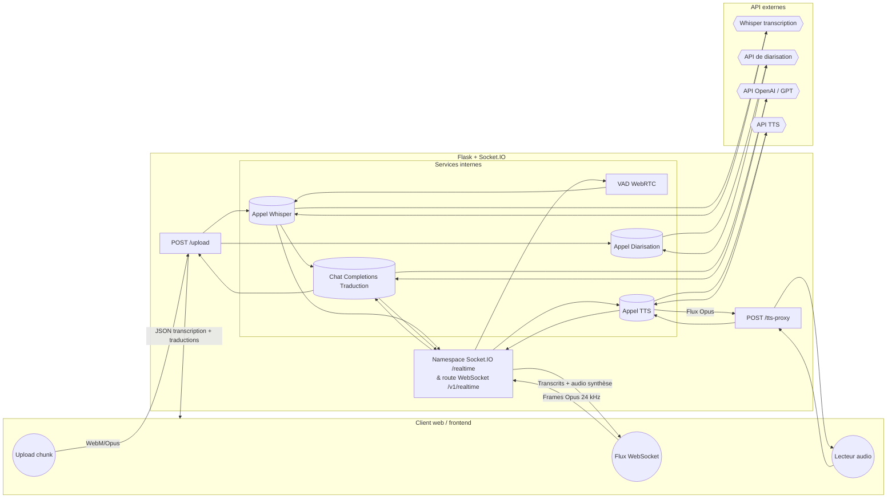

# api-translate-rt

Backend service that powers the translate-rt prototype. It exposes synchronous REST endpoints for chunk-based transcription/translation as well as a realtime Socket.IO namespace capable of low-latency streaming with voice activity detection (VAD) and optional text-to-speech (TTS).

## Diagramme d'architecture API



## Environment configuration

Populate the environment variables described below before launching `app.py`. The root project contains a [.env.example](../.env.example) file that can be copied to `.env` and customised for local runs.

| Variable | Required | Description |
| --- | --- | --- |
| `AUDIO_API_KEY` | ✅ | Bearer token passed to the Whisper transcription endpoint (`Cfg.WHISPER_URL`). |
| `OPENAI_API_KEY` | ✅ | Token used when requesting translations through `Cfg.OPENAI_API_BASE`. |
| `OPENAI_API_BASE` | ⚙️ | Base URL of the translation provider (defaults to the OpenAI public API). |
| `OPENAI_API_MODEL` | ⚙️ | Chat-completions model name used for translations (defaults to `gpt-oss`). |
| `DIARIZATION_TOKEN` | ⚙️ | Enables diarisation calls to `Cfg.DIAR_URL` when present. |
| `TTS_API_KEY` | ⚙️ | Required for `/tts-proxy` and realtime audio playback. |
| `TTS_API_URL` | ⚙️ | Overrides the default text-to-speech endpoint. |
| `API_TOKENS` | ⚙️ | Comma-separated list of accepted bearer tokens for the `/realtime` namespace. |
| `SERVER_NAME` | ⚙️ | Host interface for the Flask + Socket.IO server (defaults to `0.0.0.0`). |
| `SERVER_PORT` | ⚙️ | Listening port (defaults to `5001`). |
| `VAD_AGGR` | ⚙️ | Aggressiveness level (0–3) for the WebRTC VAD used during realtime streaming. |

> ℹ️ Environment variables marked with ⚙️ are optional; omit them to rely on the defaults baked into [`app.py`](app.py).

### Local launch

```bash
python3 -m venv .venv
source .venv/bin/activate
pip install --upgrade pip
pip install -r requirements.txt webrtcvad
python app.py
```

The service will report the chosen host and port on start-up. Adjust `SERVER_NAME`/`SERVER_PORT` to bind to custom interfaces.

## REST endpoints

### `POST /upload`

* **Content type:** `multipart/form-data`
* **Form fields:**
  * `file` – required audio chunk encoded as WebM/Opus.
  * `target_lang` – BCP-47 code for the language shown in the translation panel.
  * `primary_lang` – optional primary language used to build additional translations.
* **Response:** JSON payload containing the detected language, raw transcription, diarisation metadata and translations (see snippet below).

```json
{
  "detected_lang": "en",
  "transcription": "Hello everyone!",
  "diarization": {
    "identifier": "speaker-1",
    "noise": false
  },
  "translation_fr": "Bonjour à tous!"
}
```

Use this endpoint to send discrete chunks recorded in the browser or uploaded from files. The helper script [`mini_OpenAPI.yaml`](mini_OpenAPI.yaml) summarises the payload/response shape.

### `POST /tts-proxy`

* **Content type:** `application/json`
* **Headers:** `Authorization: Bearer <TTS_API_KEY>` is injected by the server when configured.
* **Body:**

```json
{
  "model": "gpt-4o-mini-tts",
  "input": "Texte à dire",
  "voice": "alloy",
  "instructions": "Speak in a cheerful and positive tone.",
  "response_format": "opus"
}
```

The response streams an Opus audio payload suitable for immediate playback in the browser.

## Realtime namespace `/realtime`

The Socket.IO namespace accepts WebM/Opus frames encoded at 24 kHz. It performs VAD on the server side, forwards buffered audio to Whisper, emits interim and final transcripts, and—when TTS is enabled—streams back Opus audio blocks. Authentication is optional and controlled through the `API_TOKENS` variable.

Refer to the implementation in [`app.py`](app.py) for the list of message types (`transcript_temp`, `transcript_final`, `audio`, `turn_done`, …).

## Related files

* [`../static/js/code.js`](../static/js/code.js) – frontend logic that connects to `/upload`, `/tts-proxy` and the realtime Socket.IO namespace.
* [`mini_OpenAPI.yaml`](mini_OpenAPI.yaml) – OpenAPI snippet that can be imported into API tooling.
