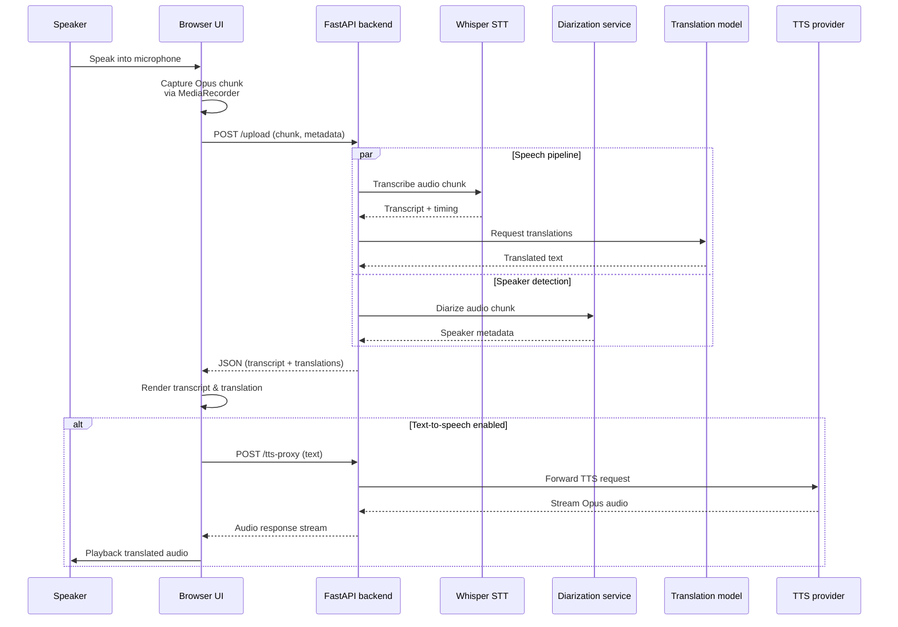

# Real-time streaming sequence

This diagram captures the end-to-end flow when the browser records speech, sends audio chunks to the backend and renders the translated output while optionally requesting text-to-speech playback.

Key takeaways:

* The browser batches microphone audio into discrete Opus chunks before sending them to the `/upload` endpoint.
* The backend starts transcription and optional diarisation together. Translation starts as soon as transcription completes, while diarisation can continue in parallel. This keeps request latency close to the slower of diarisation or the transcription-plus-translation chain instead of adding both branches together.
* The synchronous upload route runs blocking provider calls outside the ASGI event loop, and a shared HTTP session reuses upstream connections.
* When TTS is enabled, the browser issues an additional request per translation and streams the generated audio back to the user.
