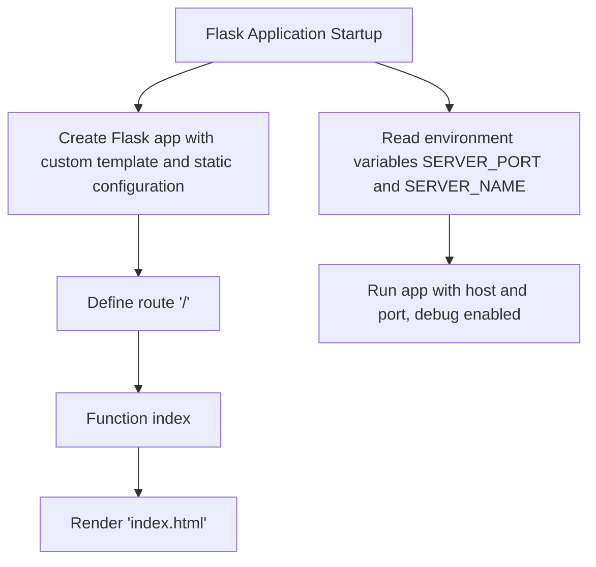

# Diagram of `frontend/app.py`

```mermaid
flowchart TD
    A[Flask Application Startup] --> B[Create Flask app with custom template and static configuration]
    B --> C[Define route '/']
    C --> D[Function index]
    D --> E[Render 'index.html']
    A --> F[Read environment variables SERVER_PORT and SERVER_NAME]
    F --> G[Run app with host and port, debug enabled]
```

This diagram summarizes the control flow and configuration inside `frontend/app.py`.
